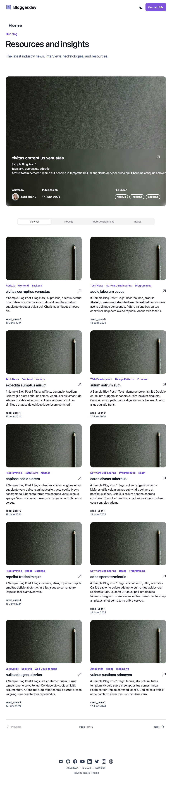

# Nextjs Strapi Tawilwind

Basic Turborepo with Nextjs and Starpi

<!--toc:start-->

- [Nextjs Strapi Tawilwind](#nextjs-strapi-tawilwind)
  - [Run Local Postgresql](#run-local-postgresql)
  - [Run Starpi](#run-starpi)
  - [Generate Api Token](#generate-api-token)
  - [Run Nextjs](#run-nextjs)
  <!--toc:end-->

## Technical & Tools

- Database
  - Postgresql
- Turborepo
- Docker
- CMS
  - Strapi
- Infra
  - Husky, Commit-lint
- Nextjs
  - Filter, Pagination
- Tailwindcss
- Typescript
- Cloudinary
- Blog markdown
- and more

## Run Local Postgresql

```bash
make dev-postgres-local
```

## Run Starpi

```bash
make run-strapi-dev
```

## Generate Api Token

Go to Strapi Dashboard -> Api Tokens and Generate, then pass to apps/nextjs-tawilwind .env.development

```text
NEXT_PUBLIC_JWT_TOKEN=
```

## Run Nextjs

```bash
make run-nextjs-dev

```

## Screenshot


